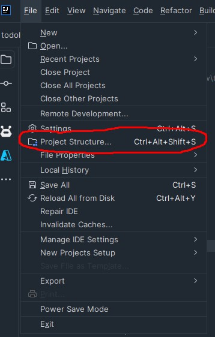
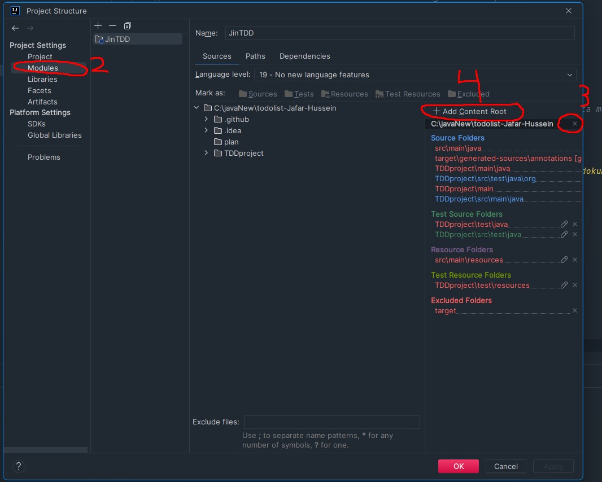
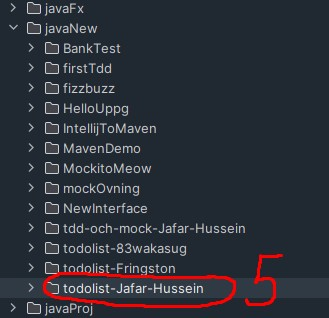

# När man klonar repo

## Steg 1
{: width="300" height="200"}

+ gå längst upp åt vänstra hörnet
+ tryck på file 
+ tryck på project structure

## Steg 2
{: width="300" height="200"}
+ tryck på modules
+ tryck på plus
+ 
{: width="300" height="200"}
+ välj filen med samma namn som projektet